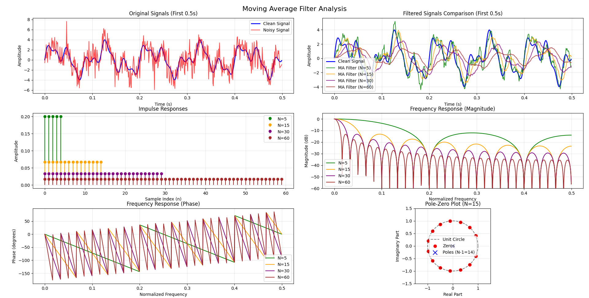
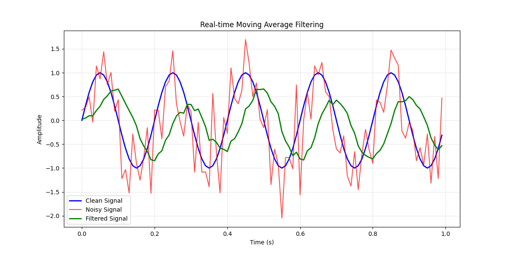

# Digital Signal Processing: Linear-Time-Invariant Systems

**Understanding Systems, Their Properties, and the Foundation of Digital Signal Processing** - A comprehensive Python exploration of LTI systems theory and practical implementations.

## 🎯 Project Overview

This project dives deep into the fundamental concepts of systems in Digital Signal Processing, focusing on Linear-Time-Invariant (LTI) systems. We explore the theoretical foundations and practical implementations that form the backbone of modern signal processing applications.

## 🌟 Why LTI Systems Matter?

Linear-Time-Invariant systems are the cornerstone of signal processing because they:
- **Predictable behavior** - Their response characteristics remain constant over time
- **Mathematical tractability** - Can be analyzed using powerful mathematical tools
- **Superposition principle** - Complex inputs can be analyzed as combinations of simpler inputs
- **Frequency domain analysis** - Enable elegant analysis using Fourier transforms
- **Practical relevance** - Most real-world processing systems can be modeled as LTI systems

## 📋 Learning Objectives & Content

### 🔧 What are Systems?
Understanding the fundamental concept of systems in signal processing:
- **Definition**: A system processes input signals to produce output signals
- **Mathematical representation**: `y[n] = T{x[n]}` where T is the system operator
- **Examples**: Filters, amplifiers, delay lines, and processing algorithms

### 📊 Representing a System
Different ways to characterize and describe system behavior:
- **Block diagrams** and signal flow graphs
- **Difference equations** and transfer functions
- **Impulse response** and frequency response
- **Input-output relationships**

### 🎛️ Preview: A Simple Filter Implementation
Our **Moving Average Filter** demonstrates core LTI concepts:
- **System equation**: `y[n] = (1/N) Σ(k=0 to N-1) x[n-k]`
- **Practical implementation** with real-time processing
- **Frequency response analysis** showing low-pass characteristics

### 🔗 Relationships to Differential and Difference Equations
Mathematical foundations connecting continuous and discrete systems:
- **Difference equations** for discrete-time systems
- **Relationship to differential equations** in continuous-time
- **Order and complexity** of system descriptions

### 🔄 Connecting Systems Together
System interconnection methods and their implications:
- **Serial (Cascade)**: `y[n] = T₂{T₁{x[n]}}`
- **Parallel**: `y[n] = T₁{x[n]} + T₂{x[n]}`
- **Feedback**: Systems with output fed back to input

## 🏗️ System Properties

### ⏰ Causality
**Definition**: A system is causal if the output at time n depends only on current and past inputs.
- **Mathematical condition**: `y[n]` depends only on `x[k]` for `k ≤ n`
- **Physical realizability**: All real-time systems must be causal
- **Examples**: Filters, amplifiers (causal) vs. ideal brickwall filters (non-causal)

### 📏 Linearity
**Definition**: A system satisfies the principle of superposition.

**Formal condition**: If `T{x₁[n]} = y₁[n]` and `T{x₂[n]} = y₂[n]`, then:
```
T{ax₁[n] + bx₂[n]} = ay₁[n] + by₂[n]
```

#### 🔍 Formally Proving Linearity
**Method**: Show that the system satisfies both:
1. **Additivity**: `T{x₁[n] + x₂[n]} = T{x₁[n]} + T{x₂[n]}`
2. **Homogeneity**: `T{ax[n]} = aT{x[n]}`

**Example proof** for moving average filter:
```python
# For inputs x₁[n] and x₂[n]:
# MA{x₁[n] + x₂[n]} = (1/N) Σ(x₁[n-k] + x₂[n-k])
#                   = (1/N) Σx₁[n-k] + (1/N) Σx₂[n-k]
#                   = MA{x₁[n]} + MA{x₂[n]} ✓
```

#### ❌ Disproving Linearity with Counterexample
**Method**: Find inputs where `T{ax₁[n] + bx₂[n]} ≠ aT{x₁[n]} + bT{x₂[n]}`

**Example**: Square-law system `y[n] = x²[n]`
```python
# Let x₁[n] = 1, x₂[n] = 1, a = b = 1
# T{x₁[n] + x₂[n]} = T{2} = 4
# aT{x₁[n]} + bT{x₂[n]} = 1·1 + 1·1 = 2
# Since 4 ≠ 2, system is nonlinear
```

### ⏳ Time Invariance
**Definition**: A system's behavior doesn't change over time - a time shift in input causes the same time shift in output.

**Mathematical condition**: If `T{x[n]} = y[n]`, then `T{x[n-n₀]} = y[n-n₀]`

#### 🔍 Formally Proving Time Invariance
**Method**: Show that delaying the input by n₀ samples produces the same delay in output.

**Example proof** for moving average filter:
```python
# Original: y[n] = (1/N) Σ(k=0 to N-1) x[n-k]
# Delayed input: T{x[n-n₀]} = (1/N) Σ(k=0 to N-1) x[n-n₀-k]
# This equals y[n-n₀], so system is time-invariant ✓
```

#### ❌ Disproving Time Invariance with Counterexample
**Method**: Find a case where time-shifted input doesn't produce time-shifted output.

**Example**: Time-varying gain `y[n] = n·x[n]`
```python
# For x[n] = δ[n]:
# T{x[n]} = n·δ[n] = 0 (since δ[n] = 0 for n ≠ 0)
# T{x[n-1]} = n·δ[n-1] but y[n-1] would be (n-1)·δ[n]
# These are not equal, so system is time-variant
```

### 🎯 Linear, Time-Invariant (LTI) Systems
**Definition**: Systems that are both linear and time-invariant.

**Significance**: LTI systems have special properties that make them:
- **Analyzable** using convolution and Fourier methods
- **Predictable** in their frequency response
- **Designable** using established mathematical techniques

## 🔄 Superposition for LTI Systems

### 📐 Response to Sum of Scaled, Shifted Delta Functions
Any discrete signal can be expressed as:
```
x[n] = Σ(k=-∞ to ∞) x[k]δ[n-k]
```

For an LTI system, the response becomes:
```
y[n] = Σ(k=-∞ to ∞) x[k]h[n-k]
```
where `h[n]` is the impulse response.

### 🎯 The Impulse Response
**Definition**: The response of a system to a unit impulse δ[n].

**Notation**: `h[n] = T{δ[n]}`

**Significance**: 
- **Complete characterization** - The impulse response completely describes an LTI system
- **Convolution relationship** - `y[n] = x[n] * h[n]`
- **Design tool** - System behavior can be designed by shaping h[n]

### 🔑 The Impulse Response Completely Characterizes an LTI System
**Key insight**: If you know h[n], you can predict the system's response to ANY input signal.

**Mathematical foundation**:
```
y[n] = Σ(k=-∞ to ∞) x[k]h[n-k] = x[n] * h[n]
```

## 📊 Implementation Examples

### Current Implementations

#### 🎛️ Moving Average Filter
- **File**: `moving_average_filter.py`
- **System type**: Linear, Time-Invariant, Causal
- **Impulse response**: `h[n] = 1/N` for `0 ≤ n ≤ N-1`, 0 otherwise
- **Applications**: Noise reduction, signal smoothing


*Figure 1: Comprehensive analysis of moving average filters showing time domain signals, frequency responses, and pole-zero plots*


*Figure 2: Real-time sample-by-sample filtering demonstration*

## 🔧 Dependencies

```python
numpy>=1.21.0      # Numerical computing
matplotlib>=3.5.0  # Plotting and visualization  
scipy>=1.8.0       # Signal processing tools
```

## 🚀 Usage Examples

### Basic Moving Average Filter
```python
from moving_average_filter import MovingAverageFilter

# Create filter with window size 10
ma_filter = MovingAverageFilter(window_size=10)

# Process individual samples
filtered_sample = ma_filter.filter_sample(input_sample)

# Process entire signal
filtered_signal = ma_filter.filter_signal(input_signal)

# Analyze frequency response
frequencies, magnitude, phase = ma_filter.get_frequency_response()
```

### System Analysis
```python
# Get impulse response
h = ma_filter.get_impulse_response()

# Verify LTI properties
# Linearity: T{ax₁ + bx₂} = aT{x₁} + bT{x₂}
# Time-invariance: T{x[n-k]} = y[n-k]
```

## 📚 Educational Outcomes

After completing this module, you will understand:

### **Theoretical Concepts**
- What systems are and how they process signals
- The mathematical definition and importance of linearity
- The concept of time-invariance and its implications
- Why LTI systems are fundamental to signal processing

### **Mathematical Skills**
- How to prove system linearity formally
- How to construct counterexamples for nonlinear systems
- How to verify time-invariance mathematically
- Understanding of convolution and impulse response

### **Practical Applications**
- Implementation of real-time filtering algorithms
- System design using impulse response shaping
- Frequency domain analysis of LTI systems
- Performance evaluation of filtering systems

## 🎓 Connection to Course Material

This project implements concepts from **Sections 2.2-2.3** of the standard DSP textbook (Proakis and Manolakis, 4th ed.), providing:

- **Theoretical foundation** with rigorous mathematical treatment
- **Practical implementations** with working Python code
- **Visual demonstrations** of key concepts
- **Hands-on experiments** to reinforce learning

## 🔮 What's Next?

This foundation prepares you for advanced DSP topics:
- **Convolution** and its properties
- **Fourier Transform** analysis of LTI systems
- **Z-Transform** and system transfer functions
- **Digital filter design** techniques
- **Frequency response** shaping and design

## 🤝 Contributing

Enhance this educational resource by adding:
1. **New system examples** (high-pass filters, differentiators, etc.)
2. **Interactive visualizations** of system properties
3. **Additional proof examples** for linearity and time-invariance
4. **Real-world applications** of LTI systems

## 📄 License

This project is for educational purposes. Feel free to use and modify for learning DSP concepts.

---

**Digital Signal Processing: Linear-Time-Invariant Systems**  
**Author**: DSP Student  
**Date**: June 26, 2025  
**Course**: Digital Signal Processing Fundamentals  
**Textbook Reference**: Sections 2.2-2.3 (Proakis and Manolakis, 4th ed.)
